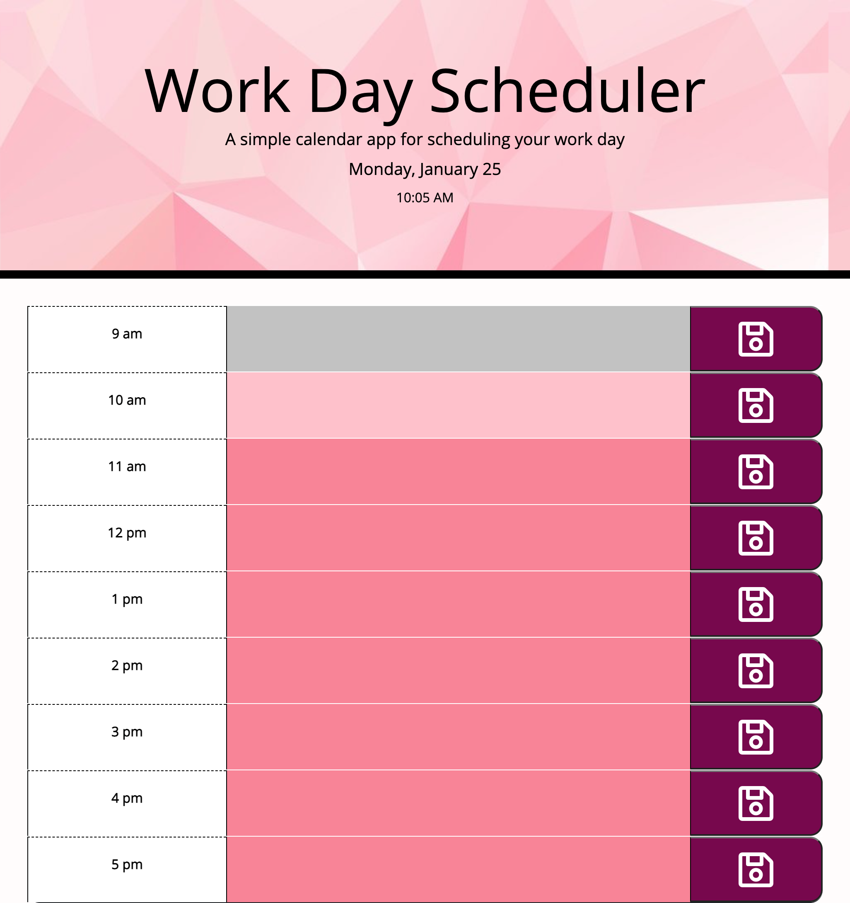

# daily-workday-planner
A daily calendar for creating and maintaining a schedule
 
This project called for the creation of a daily planner that would allow an employee to enter and save reminders for each hour of the work day. For retrieving and displaying the current day/date I made use of Luxon's DateTime methods and used jQuery for the creation of the actual planner. 

On opening th planner, the employee is presented with time blocks for standard business hours and the current date and time is displayed at the top of the page. If the time-block represents a time that is past, it will be colored grey and input to that field will be disabled. If the time-block represents the present time, it will be colored light pink and input will be possible. If the time-blocks represents future times, they will be colored dark pink and input will be possible.

On entering reminders, the employee can save them by clicking the provided buttons and on refreshing the page, the reminders will still be present. For this functionality, local storage was made use of.

Attached  is an image of the UI of the planner:

Attached is the link to the github repository of the project:

https://github.com/nidaqg/daily-workday-planner 

Attached is the link to the deployed project:

https://nidaqg.github.io/daily-workday-planner/ 

